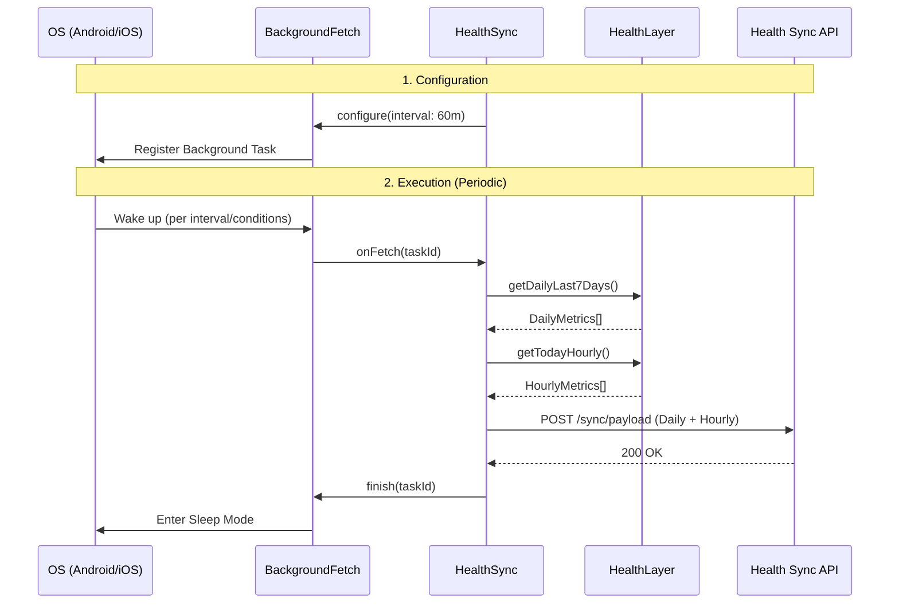

# Background Synchronization Flow

This diagram explains the background periodic sync mechanism using `react-native-background-fetch`.

## Key Configuration

- **Interval**: Configured for 60 minutes (minimum allowed by most systems).
- **Persistence**: `stopOnTerminate: false` and `startOnBoot: true` ensure the sync survives app closures and device restarts.
- **Payload**: Includes unified daily and hourly data points for the last 7 days to ensure consistency between app and server records.
