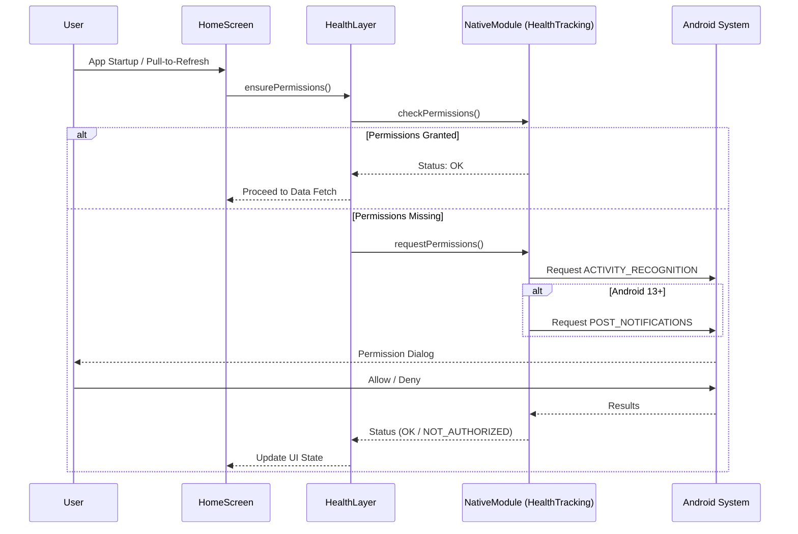

# Permissions & Authorization Flow

This diagram illustrates how the application handles Android system permissions for activity recognition and notifications.

## Required Permissions

1.  **ACTIVITY_RECOGNITION**: Required for the background tracking module to receive step and movement updates from device sensors.
2.  **POST_NOTIFICATIONS** (Android 13+): Required if the app needs to show sync status or alerts to the user.
3.  **Health Connect Permissions**: (Handled by the Health Connect SDK) Required for reading/writing data to the system-wide health store.
