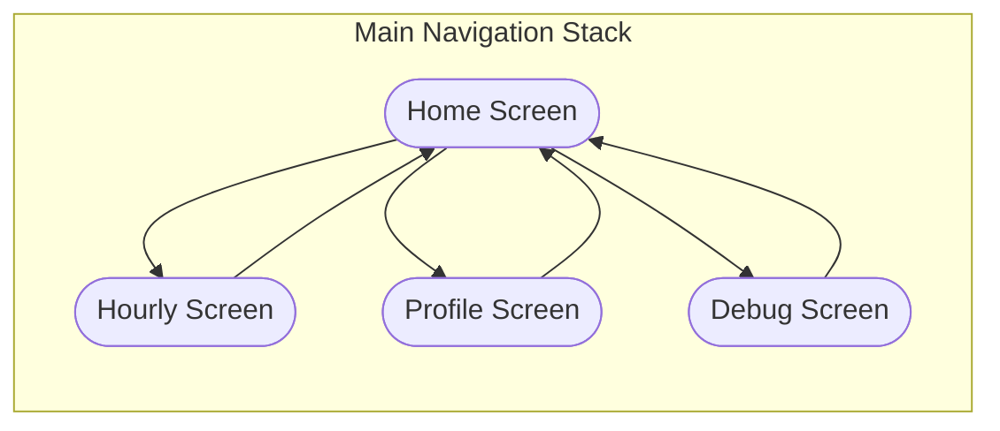
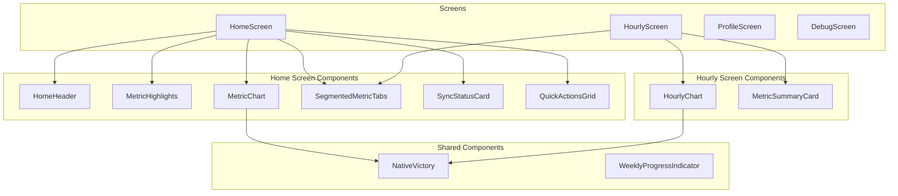
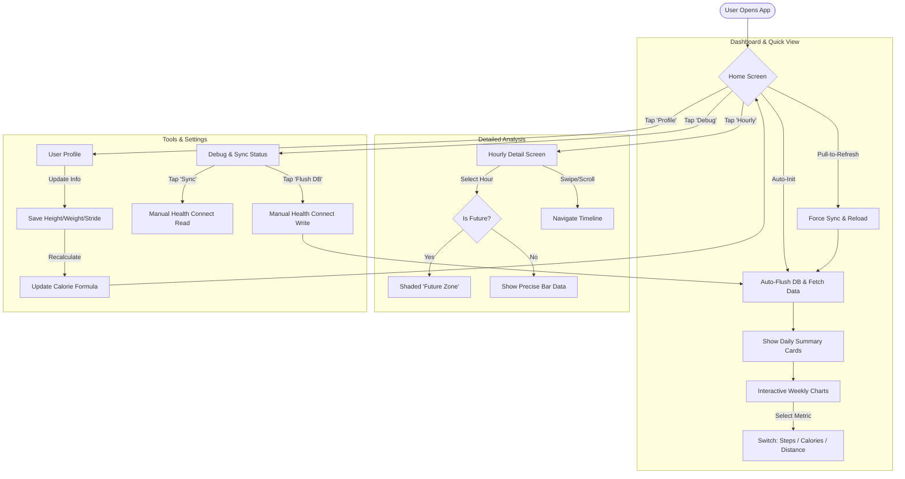
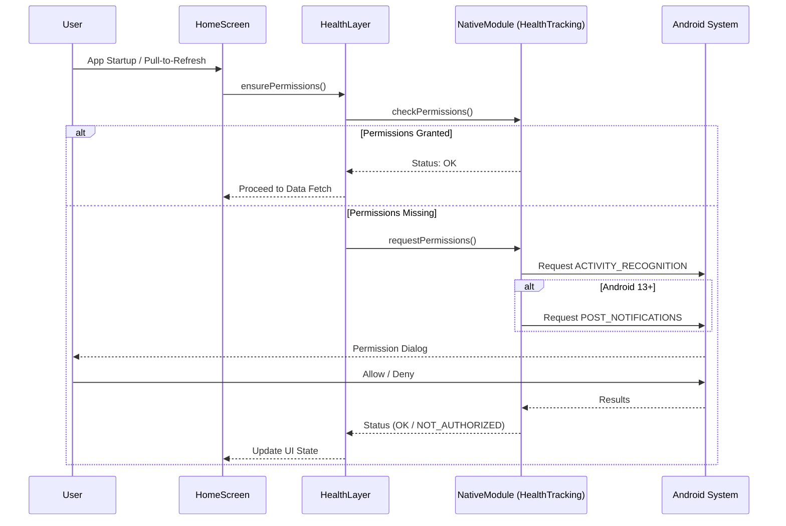
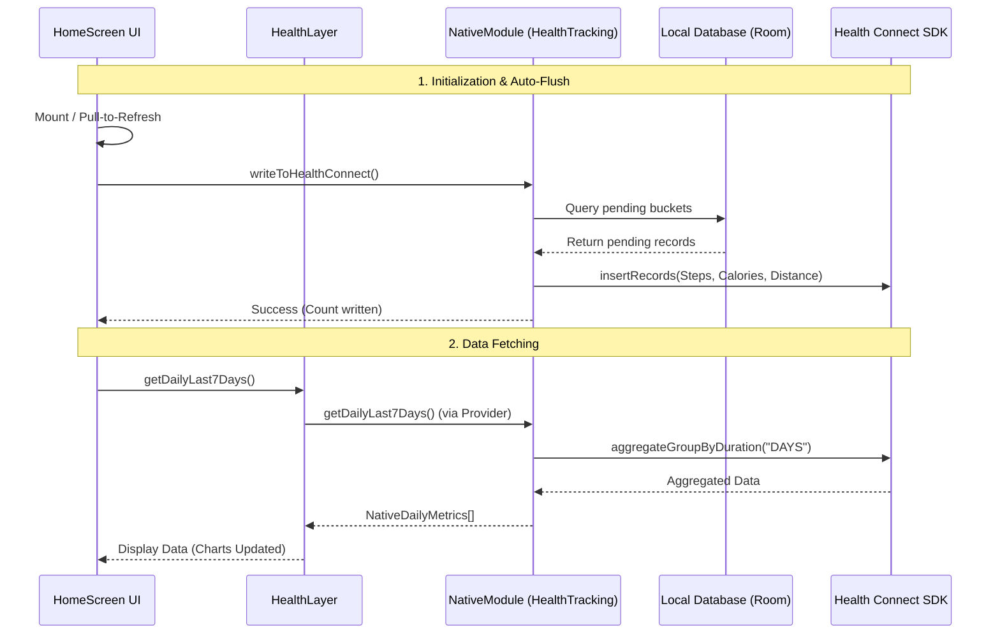
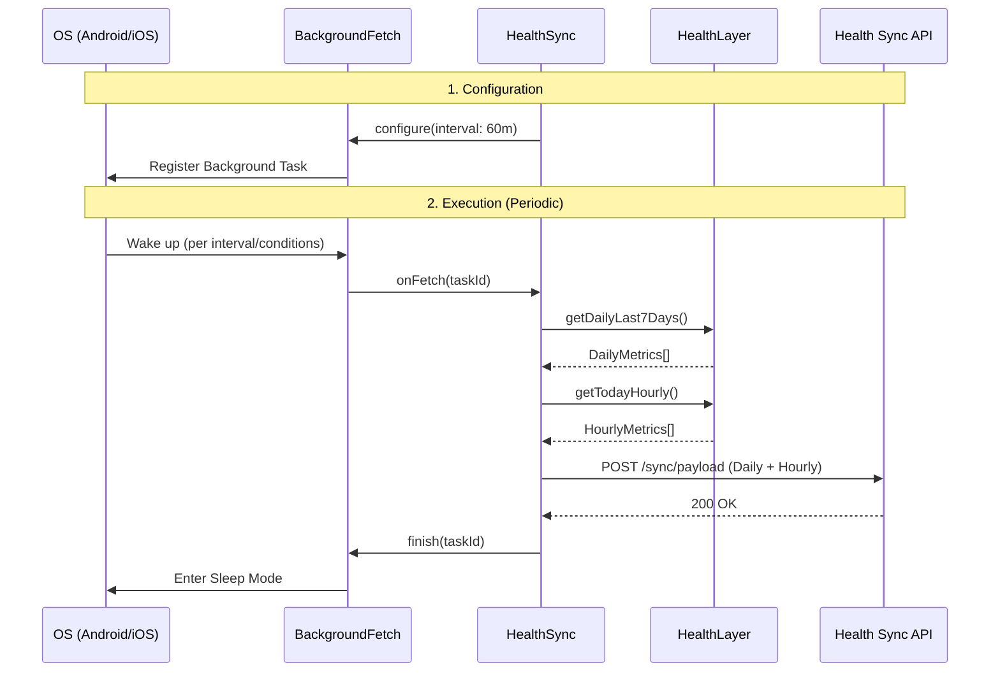
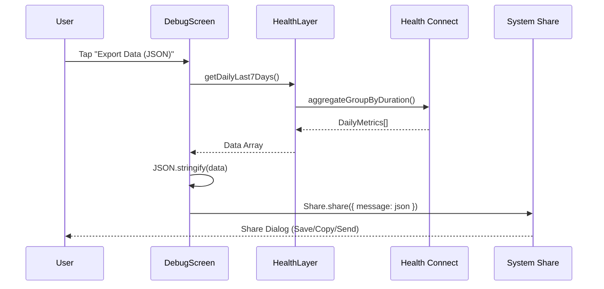
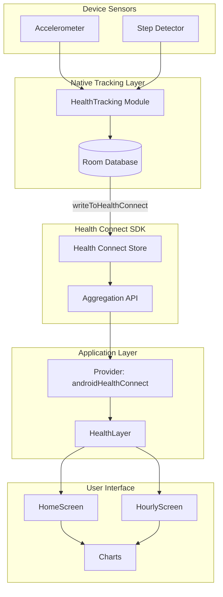

# Comprehensive Project Flow Documentation

This document provides a complete visual overview of the application's architecture, data handling, and user journey.

## 1. Navigation Flow

## 2. Component Architecture

## 3. Functional Flow (User Journey)

## 4. Permissions & Authorization Flow

## 5. Data Flow (Auto‑Flush)

## 6. Background Synchronization Flow

## 7. Data Export Flow

## 8. Health Data Pipeline

